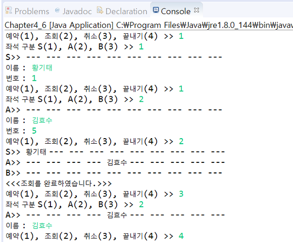

# Chapter 4 problem 6

## Overview

```$xslt
간단한 공연 예약 시스템을 만들어보자.
다수의 클래스를 다루고 객체의 배열을 다루기에는 아직 자바로 프로그램 개발이 익숙하지 않은
초보자에게 다소 무리가 있을 것이다. 그러나 반드시 넘어야 할 산이다.
이 도전 주제를 통해 산을 넘어갈 수 있는 체력을 키워보자. 공연 예약 시스템의 내용은 다음과 같다.

 - 공연은 하루에 한 번 있다.
 - 좌석은 S석, A석, B석 타입이 있으며 모두 10석의 좌석이 있다.
 - 공연 예약 시스템의 메뉴는 "예약", "조회", "취소", "끝내기"가 있다.
 - 예약은 한 자리만 예약할 수 있고 좌석 타입, 예약자 이름, 좌석 번호를 순서대로 입력받아 예약한다.
 - 조회는 모든 종류의 좌석을 표시한다.
 - 취소는 예약자의 이름을 입력하여 취소한다.
 - 없는 이름, 없는 번호, 없는 메뉴, 잘못된 취소 등에 대해서 오류 메시지를 출력하고 사용자가 다시 시도하도록 한다.
```

## Example
