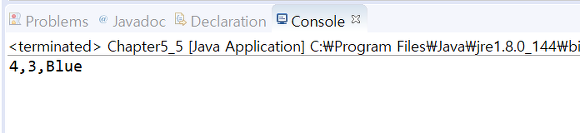

# Chapter 5 problem 5

## Overview

```$xslt
추상 클래스의 서브 클래스 만들기에 필요한 추상 메소드 오버라이딩과 super()의 사용에 관한 문제이다. 다음과 같은 MyPoint 추상 클래스가 있다.
```
```java
abstract class MyPoint {
    int x;
    int y;
    public MyPoint(int x, int y) {
        this.x = x; this.y = y;
    }
    protected abstract void move(int x, int y); // 새로운 x, y 위치로 이동
    protected abstract void reverse(); // (x, y)에서 (y, x)로 위치 변경
    protected void show() {
        System.out.println(x+","+y);
    }
}
```
```$xslt
MyPoint를 상속받는 MyColorPoint 클래스를 작성하라.
MyColorPoint의 생성자는 MyColorPoint(int x, int y, String color)로 하라. 그리고 다음과 같은 main() 메소드를 삽입하여 실행되도록 하라.
```
```java
public static void main(String[] args) {
    MyPoint p = new MyColorPoint(2, 3, "blue");
    p.move(3,4);
    p.reverse();
    p.show();
}
```

## output

